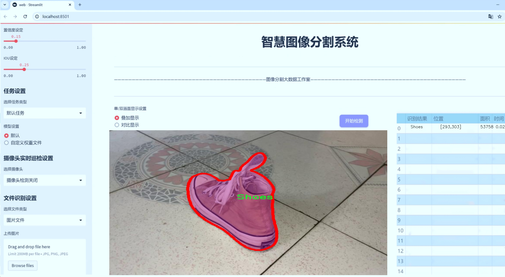
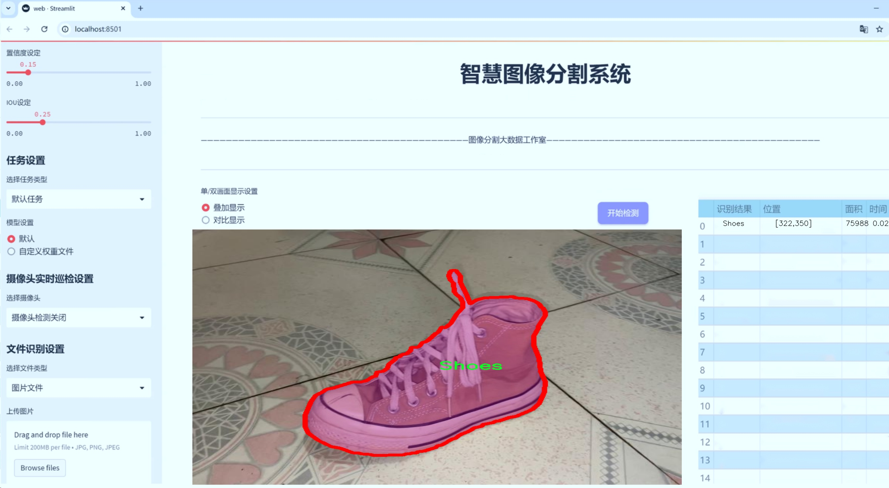
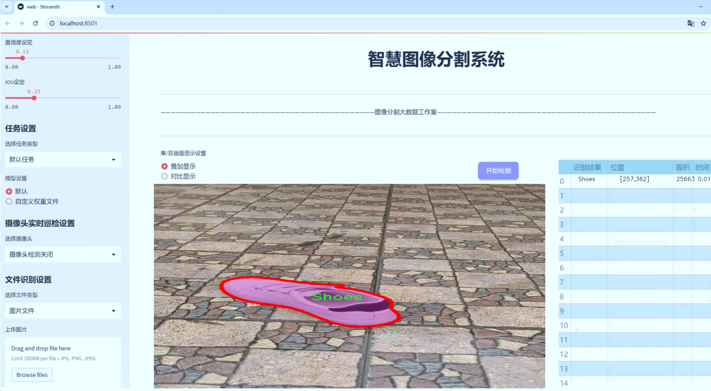
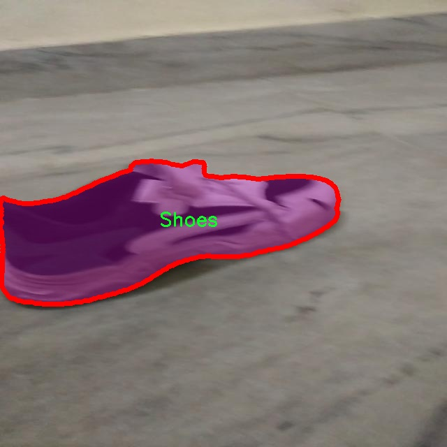
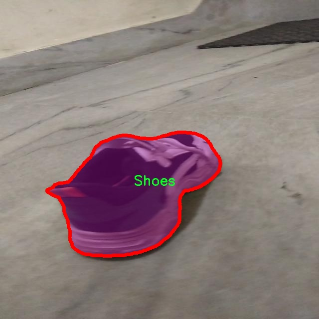
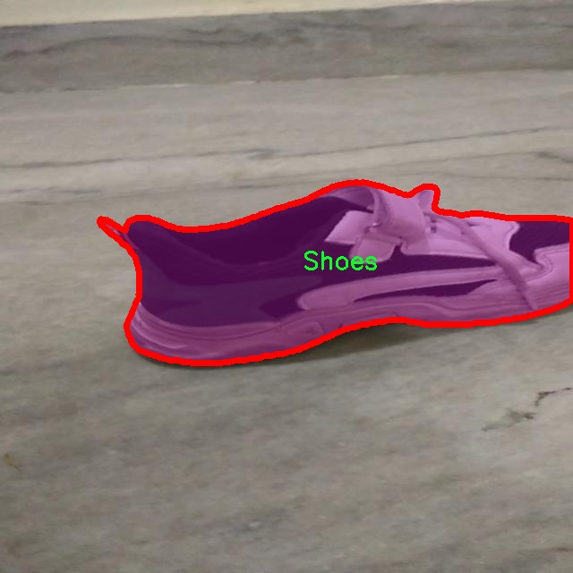
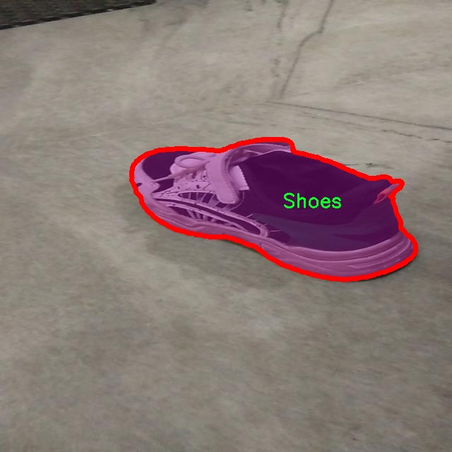
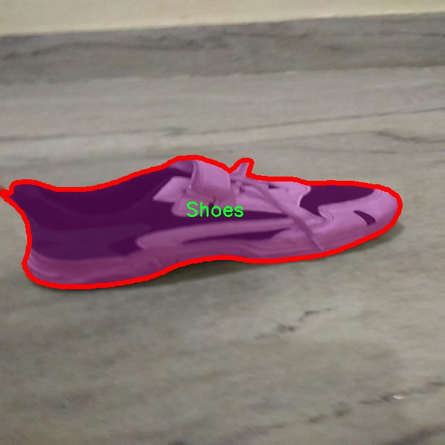

# 鞋类图像分割系统： yolov8-seg-ContextGuidedDown

### 1.研究背景与意义

[参考博客](https://gitee.com/YOLOv8_YOLOv11_Segmentation_Studio/projects)

[博客来源](https://kdocs.cn/l/cszuIiCKVNis)

研究背景与意义

随着电子商务的迅猛发展，鞋类产品的在线销售逐渐成为主流，消费者对鞋类产品的选择和购买需求日益增加。然而，在线购物的便捷性同时也带来了产品展示的挑战，尤其是在图像处理和识别方面。传统的图像分类方法往往无法满足用户对鞋类产品细节的高要求，尤其是在复杂背景下的图像分割任务。因此，开发一种高效、准确的鞋类图像分割系统显得尤为重要。

YOLO（You Only Look Once）系列模型因其快速的实时检测能力和较高的准确性，广泛应用于物体检测和图像分割任务。YOLOv8作为该系列的最新版本，具备了更强的特征提取能力和更高的检测精度，尤其在处理复杂场景时表现优异。然而，针对特定领域的图像分割任务，YOLOv8的标准模型可能无法充分发挥其潜力。因此，基于YOLOv8的改进版本进行鞋类图像分割的研究，具有重要的理论价值和实际意义。

本研究将利用一个包含3100张鞋类图像的数据集进行模型训练和测试。该数据集专注于鞋类这一单一类别，能够为模型提供充分的样本支持，使其在特定领域内实现更高的分割精度。通过对YOLOv8模型的改进，结合数据集的特性，我们期望在分割精度、速度和鲁棒性等方面取得显著提升。具体而言，改进的模型将采用更先进的特征提取网络，优化损失函数，并引入数据增强技术，以提高模型在不同光照、角度和背景下的适应能力。

此外，鞋类图像分割系统的研究不仅限于提升在线购物体验，还可以为鞋类设计、生产和库存管理提供数据支持。通过精确的图像分割，企业可以更好地分析市场趋势，优化产品设计，提升生产效率，降低库存成本。同时，消费者在选购鞋类产品时，能够获得更清晰的产品细节展示，进而提升购买决策的准确性和满意度。

综上所述，基于改进YOLOv8的鞋类图像分割系统的研究，既是对现有图像处理技术的创新应用，也是对电子商务领域中鞋类产品展示和识别需求的积极响应。通过本研究，我们期望能够推动图像分割技术在实际应用中的发展，为相关行业提供新的解决方案，进而促进整个电子商务生态的健康发展。

### 2.图片演示







注意：本项目提供完整的训练源码数据集和训练教程,由于此博客编辑较早,暂不提供权重文件（best.pt）,需要按照6.训练教程进行训练后实现上图效果。

### 3.视频演示

[3.1 视频演示](https://www.bilibili.com/video/BV1E8zmYKEPP/)

### 4.数据集信息

##### 4.1 数据集类别数＆类别名

nc: 1
names: ['Shoes']


##### 4.2 数据集信息简介

数据集信息展示

在本研究中，我们使用了名为“segment_shoe”的数据集，旨在改进YOLOv8-seg的鞋类图像分割系统。该数据集专门针对鞋类图像进行设计，具有单一类别的特征，具体类别为“Shoes”。这一简化的类别设置使得模型在训练过程中能够更加专注于鞋类的特征提取与分割，从而提高了图像分割的精度和效率。

“segment_shoe”数据集的构建经过精心策划，包含了大量高质量的鞋类图像，涵盖了不同类型、颜色和款式的鞋子。这些图像不仅包括运动鞋、休闲鞋、靴子等多种类型，还涉及不同的拍摄角度和背景设置，以确保模型在多样化的环境中能够保持良好的分割性能。数据集中的每一张图像都经过标注，确保鞋类的轮廓清晰可辨，为模型的训练提供了准确的标签信息。

在数据集的设计过程中，考虑到了实际应用中的多种场景。比如，鞋类图像可能会在不同的光照条件下拍摄，或者与其他物体共同出现在同一画面中。因此，数据集不仅注重图像的质量，还强调了多样性和复杂性，以增强模型的鲁棒性。通过这种方式，研究者希望能够训练出一个能够适应各种环境变化的鞋类图像分割系统。

为了确保数据集的有效性和实用性，研究团队在数据收集和标注过程中采用了严格的标准。每张图像都经过专业人员的审核，确保标注的准确性和一致性。此外，数据集还经过了预处理，包括图像的裁剪、缩放和归一化等操作，以适应YOLOv8-seg模型的输入要求。这些预处理步骤不仅提高了数据的可用性，还加速了模型的训练过程。

在模型训练阶段，研究者将“segment_shoe”数据集分为训练集和验证集，以便于评估模型的性能。训练集用于模型的学习，而验证集则用于实时监测模型的分割效果。通过这种方式，研究者能够及时调整模型参数，优化训练过程，确保最终模型在鞋类图像分割任务中的表现达到最佳。

总之，“segment_shoe”数据集为改进YOLOv8-seg的鞋类图像分割系统提供了坚实的基础。其单一类别的设计、丰富的图像样本以及严格的标注标准，使得该数据集在训练过程中能够有效提升模型的分割能力。随着研究的深入，期待该数据集能够为鞋类图像分割领域带来新的突破，推动相关技术的发展与应用。











### 5.项目依赖环境部署教程（零基础手把手教学）

[5.1 环境部署教程链接（零基础手把手教学）](https://www.bilibili.com/video/BV1jG4Ve4E9t/?vd_source=bc9aec86d164b67a7004b996143742dc)


[5.2 安装Python虚拟环境创建和依赖库安装视频教程链接（零基础手把手教学）](https://www.bilibili.com/video/BV1nA4VeYEze/?vd_source=bc9aec86d164b67a7004b996143742dc)

### 6.手把手YOLOV8-seg训练视频教程（零基础手把手教学）

[6.1 手把手YOLOV8-seg训练视频教程（零基础小白有手就能学会）](https://www.bilibili.com/video/BV1cA4VeYETe/?vd_source=bc9aec86d164b67a7004b996143742dc)


按照上面的训练视频教程链接加载项目提供的数据集，运行train.py即可开始训练



     Epoch   gpu_mem       box       obj       cls    labels  img_size
     1/200     0G   0.01576   0.01955  0.007536        22      1280: 100%|██████████| 849/849 [14:42<00:00,  1.04s/it]
               Class     Images     Labels          P          R     mAP@.5 mAP@.5:.95: 100%|██████████| 213/213 [01:14<00:00,  2.87it/s]
                 all       3395      17314      0.994      0.957      0.0957      0.0843

     Epoch   gpu_mem       box       obj       cls    labels  img_size
     2/200     0G   0.01578   0.01923  0.007006        22      1280: 100%|██████████| 849/849 [14:44<00:00,  1.04s/it]
               Class     Images     Labels          P          R     mAP@.5 mAP@.5:.95: 100%|██████████| 213/213 [01:12<00:00,  2.95it/s]
                 all       3395      17314      0.996      0.956      0.0957      0.0845

     Epoch   gpu_mem       box       obj       cls    labels  img_size
     3/200     0G   0.01561    0.0191  0.006895        27      1280: 100%|██████████| 849/849 [10:56<00:00,  1.29it/s]
               Class     Images     Labels          P          R     mAP@.5 mAP@.5:.95: 100%|███████   | 187/213 [00:52<00:00,  4.04it/s]
                 all       3395      17314      0.996      0.957      0.0957      0.0845


### 7.50+种全套YOLOV8-seg创新点加载调参实验视频教程（一键加载写好的改进模型的配置文件）

[7.1 50+种全套YOLOV8-seg创新点加载调参实验视频教程（一键加载写好的改进模型的配置文件）](https://www.bilibili.com/video/BV1Hw4VePEXv/?vd_source=bc9aec86d164b67a7004b996143742dc)

### YOLOV8-seg算法简介

原始YOLOV8-seg算法原理

YOLOV8-seg算法是YOLO系列中的最新版本，代表了目标检测和分割领域的一次重要进步。自2015年YOLO模型首次提出以来，YOLO系列经历了多个版本的迭代，逐步提升了推理速度、检测精度以及模型的可训练性。YOLOV8作为最新的SOTA（State Of The Art）模型，不仅在这些方面取得了显著的改进，还引入了更加灵活的网络结构和创新的算法设计，使其在实际应用中表现出色。

YOLOV8的网络结构可以分为四个主要部分：输入端、骨干网络、颈部网络和头部网络。输入端的设计至关重要，它采用了马赛克数据增强、自适应锚框计算和自适应灰度填充等技术，以提高模型对不同输入图像的适应能力。马赛克数据增强通过将多张图像拼接成一张新图像，增加了训练数据的多样性，从而提高了模型的泛化能力。自适应锚框计算则使得模型能够根据数据集的特征动态调整锚框的大小和比例，进一步提升了检测精度。

在骨干网络部分，YOLOV8引入了C2f和SPPF（Spatial Pyramid Pooling Fusion）结构。C2f模块是YOLOV8的核心特征提取单元，它通过更多的分支跨层连接来增强梯度流，使得模型在学习过程中能够获得更丰富的特征表示能力。这种设计灵感来源于YOLOv7的ELAN结构，充分利用了残差特征，显著提升了特征提取的效率。SPPF模块则通过多尺度的最大池化操作，进一步增强了网络对不同尺度特征的抽象能力，使得模型在处理复杂场景时能够更好地捕捉到目标信息。

颈部网络采用了路径聚合网络（PAN）结构，这一设计旨在加强网络对不同缩放尺度对象的特征融合能力。PAN通过有效地融合来自不同层次的特征图，确保了信息在网络中的高效流动，使得后续的检测和分割任务能够利用到更加丰富的上下文信息。这一特性在处理具有复杂背景或多尺度目标的图像时尤为重要，能够显著提升模型的检测和分割精度。

头部网络是YOLOV8的另一大创新点，它将分类和检测过程进行了有效的解耦。传统的YOLO模型通常采用耦合头结构，而YOLOV8则引入了两个并行的卷积分支，分别计算回归和类别的损失。这种解耦设计不仅简化了损失计算过程，还使得模型在处理复杂任务时能够更灵活地调整各个分支的权重，从而提升整体性能。具体而言，YOLOV8在损失计算中采用了Task Aligned Assigner策略，根据分类与回归的分数加权结果选择正样本，确保了模型在训练过程中的高效性。

在损失函数的选择上，YOLOV8结合了二元交叉熵损失（Binary Cross Entropy Loss）和分布焦点损失（Distribution Focal Loss），以及完全交并比损失函数（Complete Intersection over Union Loss），以提升模型对边界框预测的精准性。这种多样化的损失函数设计，使得YOLOV8在处理不同类型的目标时，能够更加准确地进行分类和定位。

值得一提的是，YOLOV8还引入了无锚框检测头（Anchor-Free Detection Head），这一创新显著减少了锚框预测的数量，进而加速了非最大抑制（Non-Maximum Suppression, NMS）过程。这一设计不仅提高了模型的推理速度，还简化了模型的训练过程，使得YOLOV8在实际应用中更加高效。

总的来说，YOLOV8-seg算法通过引入先进的网络结构和创新的算法设计，显著提升了目标检测和分割的性能。其灵活的模型设置和高效的特征提取能力，使得YOLOV8在各种应用场景中表现出色，无论是在实时性要求高的监控系统，还是在需要高精度的医学图像分析中，YOLOV8都展现出了其强大的适应能力和出色的性能。随着YOLOV8的不断发展和应用，其在目标检测和分割领域的影响力将会愈加显著，成为研究者和工程师们的重要工具。


### 9.系统功能展示（检测对象为举例，实际内容以本项目数据集为准）

图9.1.系统支持检测结果表格显示

  图9.2.系统支持置信度和IOU阈值手动调节

  图9.3.系统支持自定义加载权重文件best.pt(需要你通过步骤5中训练获得)

  图9.4.系统支持摄像头实时识别

  图9.5.系统支持图片识别

  图9.6.系统支持视频识别

  图9.7.系统支持识别结果文件自动保存

  图9.8.系统支持Excel导出检测结果数据


### 10.50+种全套YOLOV8-seg创新点原理讲解（非科班也可以轻松写刊发刊，V11版本正在科研待更新）

#### 10.1 由于篇幅限制，每个创新点的具体原理讲解就不一一展开，具体见下列网址中的创新点对应子项目的技术原理博客网址【Blog】：


[10.1 50+种全套YOLOV8-seg创新点原理讲解链接](https://gitee.com/qunmasj/good)

#### 10.2 部分改进模块原理讲解(完整的改进原理见上图和技术博客链接)【如果此小节的图加载失败可以通过CSDN或者Github搜索该博客的标题访问原始博客，原始博客图片显示正常】

### YOLOv8简介


由上图可以看出，C2中每个BottlNeck的输入Tensor的通道数channel都只是上一级的0.5倍，因此计算量明显降低。从另一方面讲，梯度流的增加，t也能够明显提升收敛速度和收敛效果。
C2i模块首先以输入tensor(n.c.h.w)经过Conv1层进行split拆分，分成两部分(n,0.5c,h,w)，一部分直接经过n个Bottlenck，另一部分经过每一操作层后都会以(n.0.5c,h,w)的尺寸进行Shortcut，最后通过Conv2层卷积输出。也就是对应n+2的Shortcut(第一层Conv1的分支tensor和split后的tensor为2+n个bottenlenneck)。
#### Neck
YOLOv8的Neck采用了PANet结构，如下图所示。

Backbone最后SPPF模块(Layer9)之后H、W经过32倍下采样，对应地Layer4经过8倍下采样，Layer6经过16倍下采样。输入图片分辨率为640*640，得到Layer4、Layer6、Layer9的分辨率分别为80*80、40*40和20*20。
Layer4、Layer6、Layer9作为PANet结构的输入，经过上采样，通道融合，最终将PANet的三个输出分支送入到Detect head中进行Loss的计算或结果解算。
与FPN(单向，自上而下)不同的是，PANet是一个双向通路网络，引入了自下向上的路径，使得底层信息更容易传递到顶层。
#### Head
Head部分相比Yolov5改动较大，直接将耦合头改为类似Yolo的解耦头结构(Decoupled-Head)，将回归分支和预测分支分离，并针对回归分支使用了Distribution Focal Loss策略中提出的积分形式表示法。之前的目标检测网络将回归坐标作为一个确定性单值进行预测，DFL将坐标转变成一个分布。


### LSKNet的架构
该博客提出的结构层级依次为：

LSK module（大核卷积序列+空间选择机制） < LSK Block （LK Selection + FFN）<LSKNet（N个LSK Block）


#### LSK 模块

LSK Block
LSKNet 是主干网络中的一个可重复堆叠的块（Block），每个LSK Block包括两个残差子块，即大核选择子块（Large Kernel Selection，LK Selection）和前馈网络子块（Feed-forward Network ，FFN），如图8。LK Selection子块根据需要动态地调整网络的感受野，FFN子块用于通道混合和特征细化，由一个全连接层、一个深度卷积、一个 GELU 激活和第二个全连接层组成。

LSK module（LSK 模块，图4）由一个大核卷积序列（large kernel convolutions）和一个空间核选择机制（spatial kernel selection mechanism）组成，被嵌入到了LSK Block 的 LK Selection子块中。

#### Large Kernel Convolutions
因为不同类型的目标对背景信息的需求不同，这就需要模型能够自适应选择不同大小的背景范围。因此，作者通过解耦出一系列具有大卷积核、且不断扩张的Depth-wise 卷积，构建了一个更大感受野的网络。

具体地，假设序列中第i个Depth-wise 卷积核的大小为 ，扩张率为 d，感受野为 ，它们满足以下关系：


卷积核大小和扩张率的增加保证了感受野能够快速增大。此外，我们设置了扩张率的上限，以保证扩张卷积不会引入特征图之间的差距。


Table2的卷积核大小可根据公式（1）和（2）计算，详见下图：


这样设计的好处有两点。首先，能够产生具有多种不同大小感受野的特征，便于后续的核选择；第二，序列解耦比简单的使用一个大型卷积核效果更好。如上图表2所示，解耦操作相对于标准的大型卷积核，有效地将低了模型的参数量。

为了从输入数据  的不同区域获取丰富的背景信息特征，可采用一系列解耦的、不用感受野的Depth-wise 卷积核：


其中，是卷积核为 、扩张率为  的Depth-wise 卷积操作。假设有个解耦的卷积核，每个卷积操作后又要经过一个的卷积层进行空间特征向量的通道融合。


之后，针对不同的目标，可基于获取的多尺度特征，通过下文中的选择机制动态选择合适的卷积核大小。

这一段的意思可以简单理解为：

把一个大的卷积核拆成了几个小的卷积核，比如一个大小为5，扩张率为1的卷积核加上一个大小为7，扩张率为3的卷积核，感受野为23，与一个大小为23，扩张率为1的卷积核的感受野是一样的。因此可用两个小的卷积核替代一个大的卷积核，同理一个大小为29的卷积核也可以用三个小的卷积代替（Table 2），这样可以有效的减少参数，且更灵活。

将输入数据依次通过这些小的卷积核（公式3），并在每个小的卷积核后面接上一个1×1的卷积进行通道融合（公式4）。

#### Spatial Kernel Selection
为了使模型更关注目标在空间上的重点背景信息，作者使用空间选择机制从不同尺度的大卷积核中对特征图进行空间选择。

首先，将来自于不同感受野卷积核的特征进行concate拼接，然后，应用通道级的平均池化和最大池化提取空间关系，其中， 和  是平均池化和最大池化后的空间特征描述符。为了实现不同空间描述符的信息交互，作者利用卷积层将空间池化特征进行拼接，将2个通道的池化特征转换为N个空间注意力特征图，之后，将Sigmoid激活函数应用到每一个空间注意力特征图，可获得每个解耦的大卷积核所对应的独立的空间选择掩膜，又然后，将解耦后的大卷积核序列的特征与对应的空间选择掩膜进行加权处理，并通过卷积层进行融合获得注意力特征 ，最后LSK module的输出可通过输入特征  与注意力特征  的逐元素点成获得，公式对应于结构图上的操作如下：


### 11.项目核心源码讲解（再也不用担心看不懂代码逻辑）

#### 11.1 ultralytics\cfg\__init__.py

以下是经过简化和注释的核心代码部分，保留了最重要的功能和结构：

```python
# 导入必要的库
import sys
from pathlib import Path
from types import SimpleNamespace
from typing import Dict, Union
from ultralytics.utils import yaml_load, LOGGER, DEFAULT_CFG_DICT

# 定义有效的任务和模式
MODES = 'train', 'val', 'predict', 'export', 'track', 'benchmark'
TASKS = 'detect', 'segment', 'classify', 'pose'

def cfg2dict(cfg):
    """
    将配置对象转换为字典格式。
    
    参数:
        cfg (str | Path | dict | SimpleNamespace): 要转换的配置对象。
    
    返回:
        cfg (dict): 转换后的字典格式配置对象。
    """
    if isinstance(cfg, (str, Path)):
        cfg = yaml_load(cfg)  # 从文件加载字典
    elif isinstance(cfg, SimpleNamespace):
        cfg = vars(cfg)  # 转换为字典
    return cfg

def get_cfg(cfg: Union[str, Path, Dict, SimpleNamespace] = DEFAULT_CFG_DICT, overrides: Dict = None):
    """
    加载并合并配置数据。
    
    参数:
        cfg (str | Path | Dict | SimpleNamespace): 配置数据。
        overrides (Dict | optional): 覆盖的配置字典。
    
    返回:
        (SimpleNamespace): 训练参数的命名空间。
    """
    cfg = cfg2dict(cfg)  # 转换配置为字典

    # 合并覆盖配置
    if overrides:
        overrides = cfg2dict(overrides)
        cfg = {**cfg, **overrides}  # 合并字典

    # 返回配置的命名空间
    return SimpleNamespace(**cfg)

def entrypoint(debug=''):
    """
    程序入口，解析命令行参数并执行相应的任务。
    
    参数:
        debug (str): 调试模式下的参数。
    """
    args = (debug.split(' ') if debug else sys.argv)[1:]  # 获取命令行参数
    if not args:  # 如果没有参数，显示帮助信息
        LOGGER.info("No arguments provided. Use 'yolo help' for usage instructions.")
        return

    overrides = {}  # 存储覆盖的参数
    for a in args:
        if '=' in a:  # 处理带有'='的参数
            k, v = a.split('=', 1)
            overrides[k] = v  # 存储覆盖参数
        elif a in TASKS:
            overrides['task'] = a  # 任务
        elif a in MODES:
            overrides['mode'] = a  # 模式

    # 检查模式和任务的有效性
    mode = overrides.get('mode', 'predict')  # 默认模式为预测
    task = overrides.get('task', None)  # 任务

    # 运行相应的命令
    # 假设有一个模型对象可以根据模式和任务进行调用
    model = "假设的模型对象"  # 这里应该是实际的模型实例
    getattr(model, mode)(**overrides)  # 调用模型的相应方法

if __name__ == '__main__':
    entrypoint()  # 调用入口函数
```

### 代码说明：
1. **cfg2dict**: 该函数用于将不同类型的配置对象（如字符串、路径、字典或命名空间）转换为字典格式，以便后续处理。
  
2. **get_cfg**: 该函数用于加载配置并合并任何覆盖的配置，返回一个命名空间对象，方便后续使用。

3. **entrypoint**: 这是程序的主入口，负责解析命令行参数并根据指定的任务和模式执行相应的操作。它处理参数的解析、验证和最终调用模型的方法。

4. **模型调用**: 在实际应用中，`model` 应该是一个已实例化的模型对象，能够根据模式（如训练、验证、预测等）执行相应的操作。

通过这种方式，代码的结构和功能得以保留，同时提供了详细的中文注释以帮助理解。

这个文件是Ultralytics YOLO（You Only Look Once）项目的配置模块，主要用于处理模型训练、验证、预测等任务的配置和命令行参数解析。文件中包含了多个功能函数和一些常量定义，以下是对文件内容的详细说明。

首先，文件引入了一些必要的库和模块，包括上下文管理、文件操作、路径处理、类型定义等。接着，定义了一些有效的任务和模式，例如训练（train）、验证（val）、预测（predict）、导出（export）、跟踪（track）和基准测试（benchmark），以及相应的任务类型，如检测（detect）、分割（segment）、分类（classify）和姿态估计（pose）。这些任务和模式为后续的命令行操作提供了基础。

文件中还定义了一些与任务相关的默认数据集、模型和评估指标的映射关系。这些映射关系便于在不同任务中自动选择合适的配置。例如，对于检测任务，默认使用的数据集是“coco8.yaml”，而模型则是“yolov8n.pt”。

接下来，文件中定义了一个CLI帮助信息字符串，提供了关于如何使用Ultralytics YOLO命令行工具的详细说明，包括可用的任务、模式和参数示例。这部分信息对于用户理解如何使用该工具非常重要。

文件中还定义了一些配置键的类型检查，分别包括浮点数、分数、整数和布尔值等。这些检查确保用户输入的配置参数符合预期的类型，从而避免运行时错误。

`cfg2dict`函数用于将配置对象转换为字典格式，支持字符串、路径、字典和SimpleNamespace对象。`get_cfg`函数则负责加载和合并配置数据，支持从文件或字典中读取配置，并允许用户覆盖默认配置。

`get_save_dir`函数用于根据训练、验证或预测的参数生成保存目录，确保输出结果的有序管理。`_handle_deprecation`函数处理过时的配置键，确保用户使用最新的配置选项。

`check_dict_alignment`函数用于检查自定义配置与基础配置之间的键是否匹配，确保用户输入的配置参数是有效的。`merge_equals_args`函数则用于合并命令行参数中的等号分隔的键值对，简化参数解析。

文件中还包含了处理Ultralytics HUB和YOLO设置的函数，这些函数用于管理用户的身份验证和设置重置等操作。

`entrypoint`函数是该模块的入口点，负责解析命令行参数并根据用户输入执行相应的操作。它支持多种任务和模式，并在必要时提供默认值。最后，该函数会调用相应的模型方法执行具体的任务。

最后，文件的主程序部分调用了`entrypoint`函数，允许用户通过命令行直接运行该模块，进行模型的训练、验证、预测等操作。

总体而言，这个文件是Ultralytics YOLO项目的核心配置和命令行接口部分，提供了丰富的功能以支持用户在不同任务中的需求。

#### 11.2 ultralytics\nn\backbone\repvit.py

以下是经过简化并添加详细中文注释的核心代码部分：

```python
import torch.nn as nn
import torch

# 定义一个可替换BatchNorm层的函数
def replace_batchnorm(net):
    for child_name, child in net.named_children():
        # 如果子模块有fuse_self方法，进行融合
        if hasattr(child, 'fuse_self'):
            fused = child.fuse_self()
            setattr(net, child_name, fused)
            replace_batchnorm(fused)
        # 如果子模块是BatchNorm2d，则替换为Identity
        elif isinstance(child, torch.nn.BatchNorm2d):
            setattr(net, child_name, torch.nn.Identity())
        else:
            replace_batchnorm(child)

# 确保通道数是8的倍数的函数
def _make_divisible(v, divisor, min_value=None):
    if min_value is None:
        min_value = divisor
    new_v = max(min_value, int(v + divisor / 2) // divisor * divisor)
    # 确保下调不会超过10%
    if new_v < 0.9 * v:
        new_v += divisor
    return new_v

# 定义一个包含卷积和BatchNorm的模块
class Conv2d_BN(torch.nn.Sequential):
    def __init__(self, a, b, ks=1, stride=1, pad=0, dilation=1, groups=1, bn_weight_init=1):
        super().__init__()
        # 添加卷积层
        self.add_module('c', torch.nn.Conv2d(a, b, ks, stride, pad, dilation, groups, bias=False))
        # 添加BatchNorm层
        self.add_module('bn', torch.nn.BatchNorm2d(b))
        # 初始化BatchNorm的权重
        torch.nn.init.constant_(self.bn.weight, bn_weight_init)
        torch.nn.init.constant_(self.bn.bias, 0)

    @torch.no_grad()
    def fuse_self(self):
        # 融合卷积和BatchNorm为一个卷积层
        c, bn = self._modules.values()
        w = bn.weight / (bn.running_var + bn.eps)**0.5
        w = c.weight * w[:, None, None, None]
        b = bn.bias - bn.running_mean * bn.weight / (bn.running_var + bn.eps)**0.5
        m = torch.nn.Conv2d(w.size(1) * self.c.groups, w.size(0), w.shape[2:], stride=self.c.stride, padding=self.c.padding, dilation=self.c.dilation, groups=self.c.groups)
        m.weight.data.copy_(w)
        m.bias.data.copy_(b)
        return m

# 定义残差块
class Residual(torch.nn.Module):
    def __init__(self, m, drop=0.):
        super().__init__()
        self.m = m  # 子模块
        self.drop = drop  # 随机丢弃率

    def forward(self, x):
        # 在训练时根据丢弃率决定是否添加残差
        if self.training and self.drop > 0:
            return x + self.m(x) * torch.rand(x.size(0), 1, 1, 1, device=x.device).ge_(self.drop).div(1 - self.drop).detach()
        else:
            return x + self.m(x)

    @torch.no_grad()
    def fuse_self(self):
        # 融合残差块
        if isinstance(self.m, Conv2d_BN):
            m = self.m.fuse_self()
            identity = torch.ones(m.weight.shape[0], m.weight.shape[1], 1, 1)
            identity = torch.nn.functional.pad(identity, [1, 1, 1, 1])
            m.weight += identity.to(m.weight.device)
            return m
        else:
            return self

# 定义RepViTBlock模块
class RepViTBlock(nn.Module):
    def __init__(self, inp, hidden_dim, oup, kernel_size, stride, use_se, use_hs):
        super(RepViTBlock, self).__init__()
        assert stride in [1, 2]
        self.identity = stride == 1 and inp == oup  # 判断是否为身份映射
        assert(hidden_dim == 2 * inp)  # 隐藏层维度是输入维度的两倍

        # 根据步幅选择不同的模块结构
        if stride == 2:
            self.token_mixer = nn.Sequential(
                Conv2d_BN(inp, inp, kernel_size, stride, (kernel_size - 1) // 2, groups=inp),
                nn.Identity() if not use_se else SqueezeExcite(inp, 0.25),
                Conv2d_BN(inp, oup, ks=1, stride=1, pad=0)
            )
            self.channel_mixer = Residual(nn.Sequential(
                Conv2d_BN(oup, 2 * oup, 1, 1, 0),
                nn.GELU() if use_hs else nn.GELU(),
                Conv2d_BN(2 * oup, oup, 1, 1, 0, bn_weight_init=0),
            ))
        else:
            assert(self.identity)
            self.token_mixer = nn.Sequential(
                RepVGGDW(inp),
                nn.Identity() if not use_se else SqueezeExcite(inp, 0.25),
            )
            self.channel_mixer = Residual(nn.Sequential(
                Conv2d_BN(inp, hidden_dim, 1, 1, 0),
                nn.GELU() if use_hs else nn.GELU(),
                Conv2d_BN(hidden_dim, oup, 1, 1, 0, bn_weight_init=0),
            ))

    def forward(self, x):
        return self.channel_mixer(self.token_mixer(x))

# 定义RepViT模型
class RepViT(nn.Module):
    def __init__(self, cfgs):
        super(RepViT, self).__init__()
        self.cfgs = cfgs  # 配置参数
        input_channel = self.cfgs[0][2]  # 输入通道数
        # 构建初始层
        patch_embed = torch.nn.Sequential(Conv2d_BN(3, input_channel // 2, 3, 2, 1), torch.nn.GELU(),
                                           Conv2d_BN(input_channel // 2, input_channel, 3, 2, 1))
        layers = [patch_embed]
        # 构建反向残差块
        block = RepViTBlock
        for k, t, c, use_se, use_hs, s in self.cfgs:
            output_channel = _make_divisible(c, 8)
            exp_size = _make_divisible(input_channel * t, 8)
            layers.append(block(input_channel, exp_size, output_channel, k, s, use_se, use_hs))
            input_channel = output_channel
        self.features = nn.ModuleList(layers)

    def forward(self, x):
        # 前向传播
        for f in self.features:
            x = f(x)
        return x

# 定义RepViT模型的构造函数
def repvit_m0_9(weights=''):
    cfgs = [
        # k, t, c, SE, HS, s 
        [3, 2, 48, 1, 0, 1],
        # 其他配置省略...
    ]
    model = RepViT(cfgs)
    if weights:
        model.load_state_dict(torch.load(weights)['model'])
    return model

# 其他模型构造函数省略...

if __name__ == '__main__':
    model = repvit_m0_9('repvit_m0_9_weights.pth')  # 加载模型
    inputs = torch.randn((1, 3, 640, 640))  # 创建输入张量
    res = model(inputs)  # 前向传播
    print(res.size())  # 输出结果的尺寸
```

### 代码说明：
1. **replace_batchnorm**: 替换模型中的BatchNorm层为Identity层，以便在推理时加速计算。
2. **_make_divisible**: 确保通道数是8的倍数，以满足某些网络结构的要求。
3. **Conv2d_BN**: 自定义的卷积层，包含卷积和BatchNorm，并提供融合功能。
4. **Residual**: 实现残差连接的模块，支持随机丢弃。
5. **RepViTBlock**: 代表性ViT块，包含通道混合和令牌混合的逻辑。
6. **RepViT**: 整个模型的定义，包含多个RepViTBlock。
7. **repvit_m0_9**: 用于构建特定配置的RepViT模型，并加载权重。

此代码的核心部分展示了如何构建一个具有残差连接和自定义卷积层的深度学习模型。

这个程序文件定义了一个名为 `RepViT` 的深度学习模型，主要用于图像处理任务。文件中使用了 PyTorch 框架，并且实现了一些特殊的层和模块，以构建一个高效的卷积神经网络。

首先，文件导入了必要的库，包括 `torch.nn`、`numpy` 和 `timm.models.layers` 中的 `SqueezeExcite`。接着，定义了一个名为 `replace_batchnorm` 的函数，用于替换网络中的 BatchNorm 层为 Identity 层，以便在模型推理时提高效率。

接下来，定义了一个 `_make_divisible` 函数，该函数确保网络中所有层的通道数都是可被8整除的，以满足某些硬件加速的要求。

然后，定义了一个 `Conv2d_BN` 类，它是一个包含卷积层和 BatchNorm 层的顺序容器。这个类在初始化时会创建卷积层和 BatchNorm 层，并对 BatchNorm 层的权重进行初始化。

接着，定义了一个 `Residual` 类，表示残差连接。这个类在前向传播时会将输入与经过某个模块处理后的输出相加，并在训练时引入一定的随机丢弃，以增强模型的鲁棒性。

`RepVGGDW` 类实现了一种特定的卷积结构，结合了深度可分离卷积和残差连接。它在前向传播时会将两个卷积的输出相加，并通过 BatchNorm 层进行归一化。

`RepViTBlock` 类则是构建模型的基本模块，包含了 token mixer 和 channel mixer。token mixer 负责处理输入的空间信息，而 channel mixer 则负责处理通道信息。

`RepViT` 类是整个模型的主体，它根据配置构建多个 `RepViTBlock`，并在前向传播时提取特征。该类还定义了 `switch_to_deploy` 方法，用于在推理阶段替换 BatchNorm 层。

文件中还定义了多个函数（如 `repvit_m0_9`、`repvit_m1_0` 等），用于构建不同配置的 `RepViT` 模型。这些函数会根据给定的权重文件加载预训练的模型参数。

最后，在 `__main__` 块中，程序实例化了一个 `RepViT` 模型，并对随机生成的输入数据进行前向传播，输出每个特征图的尺寸。这一部分主要用于测试模型的构建和前向传播是否正常。

总体而言，这个文件实现了一个高效的图像处理模型，结合了现代卷积神经网络的设计理念，适用于各种计算机视觉任务。

#### 11.3 ultralytics\data\build.py

以下是代码中最核心的部分，并附上详细的中文注释：

```python
import os
import random
import numpy as np
import torch
from torch.utils.data import dataloader
from .dataset import YOLODataset  # 导入YOLO数据集类
from .utils import PIN_MEMORY  # 导入内存固定的设置

class InfiniteDataLoader(dataloader.DataLoader):
    """
    无限数据加载器，重用工作线程。
    语法与普通DataLoader相同。
    """

    def __init__(self, *args, **kwargs):
        """初始化无限数据加载器，继承自DataLoader。"""
        super().__init__(*args, **kwargs)
        object.__setattr__(self, 'batch_sampler', _RepeatSampler(self.batch_sampler))  # 设置批量采样器为重复采样器
        self.iterator = super().__iter__()  # 初始化迭代器

    def __len__(self):
        """返回批量采样器的长度。"""
        return len(self.batch_sampler.sampler)

    def __iter__(self):
        """创建一个无限重复的采样器。"""
        for _ in range(len(self)):
            yield next(self.iterator)  # 迭代返回下一个样本

    def reset(self):
        """
        重置迭代器。
        当我们想在训练过程中修改数据集设置时，这个方法很有用。
        """
        self.iterator = self._get_iterator()  # 重新获取迭代器

class _RepeatSampler:
    """
    永久重复的采样器。
    """

    def __init__(self, sampler):
        """初始化一个永久重复的采样器。"""
        self.sampler = sampler

    def __iter__(self):
        """迭代并返回采样器的内容。"""
        while True:
            yield from iter(self.sampler)  # 无限迭代采样器

def seed_worker(worker_id):
    """设置数据加载器工作线程的随机种子。"""
    worker_seed = torch.initial_seed() % 2 ** 32  # 获取当前线程的随机种子
    np.random.seed(worker_seed)  # 设置numpy的随机种子
    random.seed(worker_seed)  # 设置random的随机种子

def build_yolo_dataset(cfg, img_path, batch, data, mode='train', rect=False, stride=32):
    """构建YOLO数据集。"""
    return YOLODataset(
        img_path=img_path,  # 图像路径
        imgsz=cfg.imgsz,  # 图像大小
        batch_size=batch,  # 批量大小
        augment=mode == 'train',  # 是否进行数据增强
        hyp=cfg,  # 超参数配置
        rect=cfg.rect or rect,  # 是否使用矩形批次
        cache=cfg.cache or None,  # 是否缓存数据
        single_cls=cfg.single_cls or False,  # 是否使用单类
        stride=int(stride),  # 步幅
        pad=0.0 if mode == 'train' else 0.5,  # 填充
        classes=cfg.classes,  # 类别
        data=data,  # 数据配置
        fraction=cfg.fraction if mode == 'train' else 1.0  # 训练时的样本比例
    )

def build_dataloader(dataset, batch, workers, shuffle=True, rank=-1):
    """返回用于训练或验证集的InfiniteDataLoader或DataLoader。"""
    batch = min(batch, len(dataset))  # 确保批量大小不超过数据集大小
    nd = torch.cuda.device_count()  # 获取CUDA设备数量
    nw = min([os.cpu_count() // max(nd, 1), batch if batch > 1 else 0, workers])  # 计算工作线程数量
    sampler = None if rank == -1 else distributed.DistributedSampler(dataset, shuffle=shuffle)  # 分布式采样器
    generator = torch.Generator()  # 创建随机数生成器
    generator.manual_seed(6148914691236517205 + RANK)  # 设置随机种子
    return InfiniteDataLoader(dataset=dataset,  # 返回无限数据加载器
                              batch_size=batch,
                              shuffle=shuffle and sampler is None,
                              num_workers=nw,
                              sampler=sampler,
                              pin_memory=PIN_MEMORY,
                              worker_init_fn=seed_worker,  # 设置工作线程的初始化函数
                              generator=generator)  # 设置随机数生成器
```

### 代码说明：
1. **InfiniteDataLoader**: 这是一个自定义的数据加载器，能够无限循环地返回数据，适用于需要不断迭代的数据集。它重写了`__iter__`和`__len__`方法，使得数据加载器可以在训练过程中重复使用。
  
2. **_RepeatSampler**: 这是一个内部类，用于实现无限重复的采样器。它的`__iter__`方法会不断从给定的采样器中提取样本。

3. **seed_worker**: 这个函数用于设置每个工作线程的随机种子，以确保数据加载过程中的随机性是可复现的。

4. **build_yolo_dataset**: 这个函数用于构建YOLO数据集，接收配置参数、图像路径、批量大小等信息，并返回一个YOLODataset实例。

5. **build_dataloader**: 这个函数用于构建数据加载器，支持分布式训练和多线程加载，返回一个InfiniteDataLoader实例。

这个程序文件是用于构建和管理YOLO（You Only Look Once）目标检测模型的数据加载器。它主要涉及数据集的构建、数据加载器的定义以及对输入源的检查和处理。

首先，文件导入了一些必要的库，包括操作系统、随机数生成、路径处理、NumPy、PyTorch及其相关模块，以及一些来自Ultralytics库的自定义加载器和工具函数。接着，定义了一个名为`InfiniteDataLoader`的类，这个类继承自PyTorch的`DataLoader`，其主要功能是实现一个可以无限循环使用的工作线程。它通过重写`__iter__`方法，使得数据加载器在遍历数据时可以重复使用相同的工作线程，从而提高训练效率。

在`InfiniteDataLoader`中，`_RepeatSampler`类被定义为一个可以无限重复的采样器。这个采样器会不断迭代给定的采样器，以便在训练过程中持续提供数据。

接下来，`seed_worker`函数用于设置数据加载器工作线程的随机种子，以确保每次运行时数据的随机性一致性。这对于训练模型时的可重复性非常重要。

`build_yolo_dataset`函数用于构建YOLO数据集，接收配置参数、图像路径、批量大小等信息，并返回一个`YOLODataset`实例。该函数根据训练模式决定是否进行数据增强，并根据配置设置其他参数，如图像大小、是否使用单类等。

`build_dataloader`函数则用于返回一个`InfiniteDataLoader`或标准的`DataLoader`，根据输入的参数配置数据加载的细节。它会计算可用的工作线程数量，并根据是否使用分布式训练来选择合适的采样器。

`check_source`函数用于检查输入源的类型，并返回相应的标志值。它支持多种输入类型，包括文件路径、URL、图像、视频流等，确保输入源的正确性。

最后，`load_inference_source`函数用于加载推理源，处理输入源并应用必要的转换。根据输入源的类型，它会选择不同的加载器来创建数据集，并将源类型附加到数据集对象上。

总体来说，这个文件提供了一套完整的数据加载和处理机制，旨在为YOLO模型的训练和推理提供高效、灵活的数据输入方案。

#### 11.4 ultralytics\utils\instance.py

以下是经过简化和注释的核心代码部分，主要集中在 `Bboxes` 和 `Instances` 类的实现上。

```python
import numpy as np

class Bboxes:
    """
    处理边界框的类，支持多种格式（'xyxy', 'xywh', 'ltwh'）。
    属性:
        bboxes (numpy.ndarray): 存储边界框的二维数组。
        format (str): 边界框的格式（'xyxy', 'xywh', 或 'ltwh'）。
    """

    def __init__(self, bboxes, format='xyxy') -> None:
        """初始化 Bboxes 类，设置边界框数据和格式。"""
        assert format in ['xyxy', 'xywh', 'ltwh'], f'无效的边界框格式: {format}'
        bboxes = bboxes[None, :] if bboxes.ndim == 1 else bboxes  # 如果是1D数组，转换为2D
        assert bboxes.ndim == 2 and bboxes.shape[1] == 4, '边界框必须是二维数组，且每个框有4个坐标'
        self.bboxes = bboxes
        self.format = format

    def convert(self, format):
        """将边界框格式转换为指定格式。"""
        assert format in ['xyxy', 'xywh', 'ltwh'], f'无效的边界框格式: {format}'
        if self.format == format:
            return
        # 根据当前格式和目标格式选择转换函数
        func = self._get_conversion_function(format)
        self.bboxes = func(self.bboxes)  # 转换边界框
        self.format = format  # 更新格式

    def _get_conversion_function(self, format):
        """根据当前格式和目标格式返回相应的转换函数。"""
        if self.format == 'xyxy':
            return xyxy2xywh if format == 'xywh' else xyxy2ltwh
        elif self.format == 'xywh':
            return xywh2xyxy if format == 'xyxy' else xywh2ltwh
        else:
            return ltwh2xyxy if format == 'xyxy' else ltwh2xywh

    def areas(self):
        """计算并返回每个边界框的面积。"""
        self.convert('xyxy')  # 转换为 'xyxy' 格式以计算面积
        return (self.bboxes[:, 2] - self.bboxes[:, 0]) * (self.bboxes[:, 3] - self.bboxes[:, 1])  # 宽 * 高

    def __len__(self):
        """返回边界框的数量。"""
        return len(self.bboxes)

class Instances:
    """
    存储图像中检测到的对象的边界框、分段和关键点的容器。
    属性:
        _bboxes (Bboxes): 内部对象，用于处理边界框操作。
        keypoints (ndarray): 关键点数组，形状为 [N, 17, 3]。
        segments (ndarray): 分段数组，形状为 [N, 1000, 2]。
    """

    def __init__(self, bboxes, segments=None, keypoints=None, bbox_format='xywh', normalized=True) -> None:
        """初始化 Instances 类，设置边界框、分段和关键点数据。"""
        self._bboxes = Bboxes(bboxes=bboxes, format=bbox_format)  # 创建 Bboxes 对象
        self.keypoints = keypoints
        self.normalized = normalized
        self.segments = self._process_segments(segments)  # 处理分段数据

    def _process_segments(self, segments):
        """处理分段数据，确保其形状正确。"""
        if segments is None:
            return np.zeros((0, 1000, 2), dtype=np.float32)  # 返回空分段
        segments = resample_segments(segments)  # 重采样分段
        return np.stack(segments, axis=0)  # 堆叠为三维数组

    def convert_bbox(self, format):
        """转换边界框格式。"""
        self._bboxes.convert(format=format)

    @property
    def bbox_areas(self):
        """计算边界框的面积。"""
        return self._bboxes.areas()

    def __getitem__(self, index) -> 'Instances':
        """
        使用索引获取特定实例或一组实例。
        返回:
            Instances: 包含所选边界框、分段和关键点的新 Instances 对象。
        """
        segments = self.segments[index] if len(self.segments) else self.segments
        keypoints = self.keypoints[index] if self.keypoints is not None else None
        bboxes = self._bboxes[index]
        bbox_format = self._bboxes.format
        return Instances(bboxes=bboxes, segments=segments, keypoints=keypoints, bbox_format=bbox_format, normalized=self.normalized)

    def __len__(self):
        """返回实例的数量。"""
        return len(self._bboxes)
```

### 代码说明
1. **Bboxes 类**: 该类用于处理边界框，包括初始化、格式转换和面积计算等功能。
   - `__init__`: 初始化边界框数据和格式。
   - `convert`: 转换边界框格式。
   - `areas`: 计算边界框的面积。

2. **Instances 类**: 该类用于存储图像中检测到的对象的边界框、分段和关键点。
   - `__init__`: 初始化实例，处理边界框、分段和关键点数据。
   - `convert_bbox`: 转换边界框格式。
   - `__getitem__`: 支持索引操作以获取特定实例。

这些类提供了处理边界框和实例的基本功能，适用于计算机视觉任务中的目标检测。

这个程序文件是用于处理目标检测中的边界框（bounding boxes）和相关实例（instances）的工具类，主要包含两个类：`Bboxes`和`Instances`。这些类提供了对边界框的创建、转换、操作和管理功能，支持多种边界框格式，如`xyxy`、`xywh`和`ltwh`。

首先，`Bboxes`类用于处理边界框的基本操作。它的构造函数接受一个边界框的数组和格式，确保输入的格式有效，并且边界框数据是二维的。该类提供了多种方法来转换边界框格式、计算面积、缩放和偏移边界框等。它还支持通过索引获取特定的边界框，允许用户以切片或布尔数组的方式选择边界框。

`Instances`类则是一个更复杂的容器，除了包含边界框外，还可以存储与检测对象相关的关键点和分段信息。它的构造函数接受边界框、分段和关键点的数组，并进行必要的处理，如重采样分段数据。该类同样提供了转换边界框格式、缩放、归一化和去除零面积框等功能。

在这两个类中，边界框的格式转换是一个重要的功能，支持不同的格式之间的相互转换。`Bboxes`类中的`convert`方法根据当前格式和目标格式调用相应的转换函数，而`Instances`类则通过调用`Bboxes`类的方法来实现边界框格式的转换。

此外，这些类还提供了一些实用的方法，如`clip`用于将边界框和关键点限制在图像边界内，`flipud`和`fliplr`用于上下或左右翻转边界框和关键点的坐标，`remove_zero_area_boxes`用于移除面积为零的边界框。

最后，`Bboxes`和`Instances`类都实现了`__len__`方法，允许用户获取当前对象中边界框或实例的数量。`concatenate`类方法则允许将多个`Bboxes`或`Instances`对象合并为一个新的对象，便于批量处理。

总的来说，这个文件提供了一套完整的工具来处理目标检测中的边界框和实例数据，方便用户进行各种操作和转换。

#### 11.5 ultralytics\nn\modules\utils.py

以下是经过简化和注释的核心代码部分：

```python
import torch
import torch.nn.functional as F

def inverse_sigmoid(x, eps=1e-5):
    """计算张量的反sigmoid函数。"""
    # 限制x的范围在0到1之间
    x = x.clamp(min=0, max=1)
    # 为了避免对数计算中的零值，限制x的最小值
    x1 = x.clamp(min=eps)
    x2 = (1 - x).clamp(min=eps)
    # 返回反sigmoid的结果
    return torch.log(x1 / x2)

def multi_scale_deformable_attn_pytorch(value: torch.Tensor, value_spatial_shapes: torch.Tensor,
                                        sampling_locations: torch.Tensor,
                                        attention_weights: torch.Tensor) -> torch.Tensor:
    """
    多尺度可变形注意力机制。

    参数:
    - value: 输入特征张量
    - value_spatial_shapes: 输入特征的空间形状
    - sampling_locations: 采样位置
    - attention_weights: 注意力权重

    返回:
    - 输出特征张量
    """
    # 获取输入张量的形状
    bs, _, num_heads, embed_dims = value.shape
    _, num_queries, num_heads, num_levels, num_points, _ = sampling_locations.shape
    
    # 将输入特征按空间形状分割
    value_list = value.split([H_ * W_ for H_, W_ in value_spatial_shapes], dim=1)
    # 计算采样网格
    sampling_grids = 2 * sampling_locations - 1
    sampling_value_list = []
    
    # 遍历每个尺度
    for level, (H_, W_) in enumerate(value_spatial_shapes):
        # 处理每个尺度的特征
        value_l_ = (value_list[level].flatten(2).transpose(1, 2).reshape(bs * num_heads, embed_dims, H_, W_))
        # 获取当前尺度的采样网格
        sampling_grid_l_ = sampling_grids[:, :, :, level].transpose(1, 2).flatten(0, 1)
        # 使用grid_sample进行双线性插值采样
        sampling_value_l_ = F.grid_sample(value_l_,
                                          sampling_grid_l_,
                                          mode='bilinear',
                                          padding_mode='zeros',
                                          align_corners=False)
        sampling_value_list.append(sampling_value_l_)
    
    # 调整注意力权重的形状
    attention_weights = attention_weights.transpose(1, 2).reshape(bs * num_heads, 1, num_queries,
                                                                  num_levels * num_points)
    # 计算最终输出
    output = ((torch.stack(sampling_value_list, dim=-2).flatten(-2) * attention_weights).sum(-1).view(
        bs, num_heads * embed_dims, num_queries))
    
    # 返回输出特征张量
    return output.transpose(1, 2).contiguous()
```

### 代码注释说明：
1. **inverse_sigmoid 函数**：
   - 该函数计算输入张量的反sigmoid值，确保输入在0到1之间，并通过限制最小值来避免对数计算中的零值。

2. **multi_scale_deformable_attn_pytorch 函数**：
   - 该函数实现了多尺度可变形注意力机制，主要用于处理特征图的采样和加权。
   - 输入参数包括特征张量、特征空间形状、采样位置和注意力权重。
   - 通过遍历每个尺度，使用双线性插值方法对特征进行采样，并结合注意力权重计算最终输出。

这个程序文件是Ultralytics YOLO项目中的一个工具模块，主要用于实现一些神经网络的辅助功能。文件中包含了多个函数，涉及模块的克隆、权重初始化、逆sigmoid函数的计算以及多尺度可变形注意力机制的实现。

首先，`_get_clones`函数用于创建一个指定数量的模块克隆列表。它接收一个模块和一个整数n作为参数，返回一个包含n个深拷贝模块的`ModuleList`，这在构建复杂模型时非常有用。

接下来，`bias_init_with_prob`函数根据给定的先验概率初始化卷积或全连接层的偏置值。这个函数通过计算负对数几率来返回偏置的初始值，确保模型在训练初期的偏置设置合理。

`linear_init_`函数则用于初始化线性模块的权重和偏置。它根据模块权重的形状计算一个边界值，并使用均匀分布在这个边界内初始化权重和偏置，确保权重在合理范围内，从而有助于模型的收敛。

`inverse_sigmoid`函数实现了逆sigmoid函数的计算。它对输入张量进行限制，确保值在0到1之间，然后通过对数运算计算逆sigmoid值，这在某些模型中可能用于反向传播或损失计算。

最后，`multi_scale_deformable_attn_pytorch`函数实现了多尺度可变形注意力机制。该函数接收多个张量作为输入，包括值、空间形状、采样位置和注意力权重。它首先对输入进行分割和重塑，然后通过`F.grid_sample`函数对每个尺度的值进行采样，最后结合注意力权重计算输出。这个过程涉及到对不同尺度特征的处理，适用于处理复杂的视觉任务，如目标检测和图像分割。

整体来看，这个模块提供了一些基础的工具函数和多尺度注意力机制的实现，能够为构建和训练深度学习模型提供支持。

### 12.系统整体结构（节选）

### 整体功能和构架概括

Ultralytics YOLO项目是一个用于目标检测的深度学习框架，旨在提供高效、灵活的模型训练和推理功能。该项目的整体架构由多个模块组成，每个模块负责特定的功能，包括配置管理、数据处理、模型构建和工具函数等。通过这些模块的协同工作，用户可以方便地构建、训练和评估YOLO模型。

- **配置管理**：通过`ultralytics/cfg/__init__.py`文件，提供了命令行接口和配置参数的解析，支持不同的任务和模式。
- **模型构建**：`ultralytics/nn/backbone/repvit.py`文件实现了RepViT模型的构建，支持多种卷积和注意力机制。
- **数据处理**：`ultralytics/data/build.py`文件负责数据集的构建和数据加载器的管理，确保输入数据的高效处理。
- **实例管理**：`ultralytics/utils/instance.py`文件提供了对边界框和实例的管理功能，支持多种操作和格式转换。
- **工具函数**：`ultralytics/nn/modules/utils.py`文件实现了一些基础的工具函数和多尺度注意力机制，辅助模型的构建和训练。

### 文件功能整理表

| 文件路径                                      | 功能描述                                               |
|-----------------------------------------------|------------------------------------------------------|
| `ultralytics/cfg/__init__.py`                | 管理配置参数和命令行接口，支持模型训练、验证和推理等任务。 |
| `ultralytics/nn/backbone/repvit.py`          | 实现RepViT模型的构建，包含卷积层、残差连接和多种注意力机制。 |
| `ultralytics/data/build.py`                   | 构建YOLO数据集和数据加载器，处理输入源和数据增强。       |
| `ultralytics/utils/instance.py`               | 管理边界框和实例数据，支持格式转换、操作和计算。         |
| `ultralytics/nn/modules/utils.py`             | 提供工具函数，如模块克隆、权重初始化和多尺度可变形注意力机制。 |

这个表格清晰地展示了每个文件的功能，帮助理解Ultralytics YOLO项目的整体架构和各个模块之间的关系。

### 13.图片、视频、摄像头图像分割Demo(去除WebUI)代码

在这个博客小节中，我们将讨论如何在不使用WebUI的情况下，实现图像分割模型的使用。本项目代码已经优化整合，方便用户将分割功能嵌入自己的项目中。
核心功能包括图片、视频、摄像头图像的分割，ROI区域的轮廓提取、类别分类、周长计算、面积计算、圆度计算以及颜色提取等。
这些功能提供了良好的二次开发基础。

### 核心代码解读

以下是主要代码片段，我们会为每一块代码进行详细的批注解释：

```python
import random
import cv2
import numpy as np
from PIL import ImageFont, ImageDraw, Image
from hashlib import md5
from model import Web_Detector
from chinese_name_list import Label_list

# 根据名称生成颜色
def generate_color_based_on_name(name):
    ......

# 计算多边形面积
def calculate_polygon_area(points):
    return cv2.contourArea(points.astype(np.float32))

...
# 绘制中文标签
def draw_with_chinese(image, text, position, font_size=20, color=(255, 0, 0)):
    image_pil = Image.fromarray(cv2.cvtColor(image, cv2.COLOR_BGR2RGB))
    draw = ImageDraw.Draw(image_pil)
    font = ImageFont.truetype("simsun.ttc", font_size, encoding="unic")
    draw.text(position, text, font=font, fill=color)
    return cv2.cvtColor(np.array(image_pil), cv2.COLOR_RGB2BGR)

# 动态调整参数
def adjust_parameter(image_size, base_size=1000):
    max_size = max(image_size)
    return max_size / base_size

# 绘制检测结果
def draw_detections(image, info, alpha=0.2):
    name, bbox, conf, cls_id, mask = info['class_name'], info['bbox'], info['score'], info['class_id'], info['mask']
    adjust_param = adjust_parameter(image.shape[:2])
    spacing = int(20 * adjust_param)

    if mask is None:
        x1, y1, x2, y2 = bbox
        aim_frame_area = (x2 - x1) * (y2 - y1)
        cv2.rectangle(image, (x1, y1), (x2, y2), color=(0, 0, 255), thickness=int(3 * adjust_param))
        image = draw_with_chinese(image, name, (x1, y1 - int(30 * adjust_param)), font_size=int(35 * adjust_param))
        y_offset = int(50 * adjust_param)  # 类别名称上方绘制，其下方留出空间
    else:
        mask_points = np.concatenate(mask)
        aim_frame_area = calculate_polygon_area(mask_points)
        mask_color = generate_color_based_on_name(name)
        try:
            overlay = image.copy()
            cv2.fillPoly(overlay, [mask_points.astype(np.int32)], mask_color)
            image = cv2.addWeighted(overlay, 0.3, image, 0.7, 0)
            cv2.drawContours(image, [mask_points.astype(np.int32)], -1, (0, 0, 255), thickness=int(8 * adjust_param))

            # 计算面积、周长、圆度
            area = cv2.contourArea(mask_points.astype(np.int32))
            perimeter = cv2.arcLength(mask_points.astype(np.int32), True)
            ......

            # 计算色彩
            mask = np.zeros(image.shape[:2], dtype=np.uint8)
            cv2.drawContours(mask, [mask_points.astype(np.int32)], -1, 255, -1)
            color_points = cv2.findNonZero(mask)
            ......

            # 绘制类别名称
            x, y = np.min(mask_points, axis=0).astype(int)
            image = draw_with_chinese(image, name, (x, y - int(30 * adjust_param)), font_size=int(35 * adjust_param))
            y_offset = int(50 * adjust_param)

            # 绘制面积、周长、圆度和色彩值
            metrics = [("Area", area), ("Perimeter", perimeter), ("Circularity", circularity), ("Color", color_str)]
            for idx, (metric_name, metric_value) in enumerate(metrics):
                ......

    return image, aim_frame_area

# 处理每帧图像
def process_frame(model, image):
    pre_img = model.preprocess(image)
    pred = model.predict(pre_img)
    det = pred[0] if det is not None and len(det)
    if det:
        det_info = model.postprocess(pred)
        for info in det_info:
            image, _ = draw_detections(image, info)
    return image

if __name__ == "__main__":
    cls_name = Label_list
    model = Web_Detector()
    model.load_model("./weights/yolov8s-seg.pt")

    # 摄像头实时处理
    cap = cv2.VideoCapture(0)
    while cap.isOpened():
        ret, frame = cap.read()
        if not ret:
            break
        ......

    # 图片处理
    image_path = './icon/OIP.jpg'
    image = cv2.imread(image_path)
    if image is not None:
        processed_image = process_frame(model, image)
        ......

    # 视频处理
    video_path = ''  # 输入视频的路径
    cap = cv2.VideoCapture(video_path)
    while cap.isOpened():
        ret, frame = cap.read()
        ......
```


### 14.完整训练+Web前端界面+50+种创新点源码、数据集获取


# [下载链接：https://mbd.pub/o/bread/Z5yWlp5r](https://mbd.pub/o/bread/Z5yWlp5r)